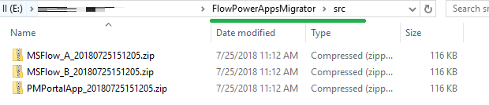
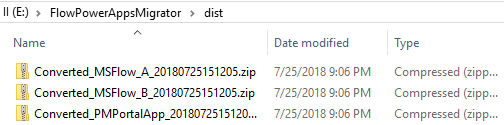

# Flow & Power Apps Migrator

Have you ever tried moving canvas apps or cloud flows across Microsoft 365 tenants or sites? This is a common task when deploying apps and flows to production. Apps and flows have to be exported, imported and SharePoint actions manually updated. These manual updates are error-prone and labor intensive. **Flow & Power Apps Migrator** automatically converts exported flows and apps to be compatible with the target environment. 

# Installation

## 1. Install [PnP PowerShell](https://github.com/SharePoint/PnP-PowerShell) prerequisites
Run the script below:

`Install-Module SharePointPnPPowerShellOnline` 

## 2. Navigate to the FlowPowerAppsMigrator folder

## 3. Place exported flows and apps in the src folder

## 4. Run RunAllSripts.ps1 form PowerShell
The scripts will iterate through all ZIP files inside the `\src` directory and convert them to be compatible with the new Microsoft 365 tenant or site.
- `powershell`
- `cd C:\FlowPowerAppsMigrator`
- `.\RunAllScripts.ps1`

Example:

## 5. Navigae to the \dist folder and collect converted flows and apps

## 6. Done
Now go ahead and import your flows and apps to the destination tenant. All SharePoint actions should now be converted to point to the new tenant that you chose.

## How it works

**Flow & Power Apps Migrator** finds all unique IDs pointing to the source SharePoint site and replaces them with the destination IDs.
