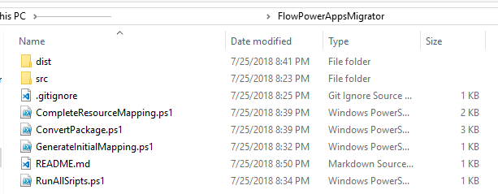
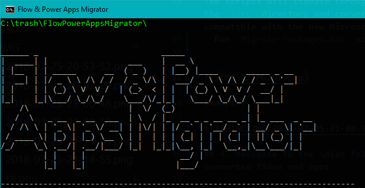
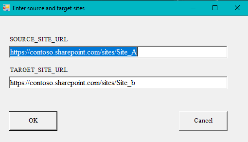
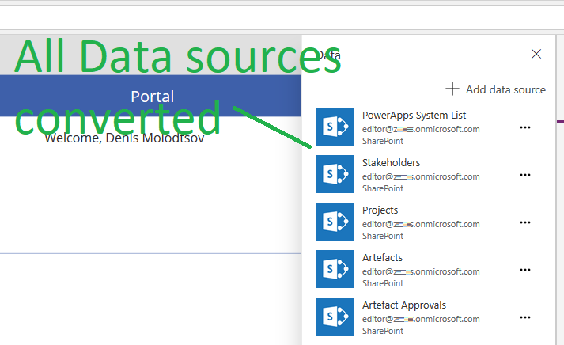

 

# Flow & Power Apps Migrator

Have you ever tried moving canvas apps or cloud flows across Microsoft 365 tenants or sites? This is a common task when deploying apps and flows to production. Apps and flows have to be exported, imported and SharePoint actions manually updated. These manual updates are error-prone and labor intensive. **Flow & Power Apps Migrator** automatically converts exported flows and apps to be compatible with the target environment. 

# Prerequisites 

- [Download the latest version of the Flow & Power Apps Migrator](https://github.com/Zerg00s/FlowPowerAppsMigrator/releases/download/2.0/FlowPowerAppsMigrator.zip).
- Extract the ZIP package.
- Make sure that SharePoint lists and libraries exist in the target environment. You can use [Move-Lists](https://github.com/Zerg00s/Move-Lists) for this purpose.

# Convert flows and apps

## Export flows and apps
First, export all your flows and apps on disk. Place them in the `\src` folder.

## 2. Place exported flows and apps in the src folder

## 3. Run Migrate-Packages.bat
The scripts will iterate through all ZIP files inside the `\src` directory and convert them to be compatible with the new Microsoft 365 tenant or site.
- Run `Migrate-Packages.bat` script

- Enter source site URL and target site URL:

- Sit back and wait for the conversion to finish.

## 4. Navigate to the \dist folder and collect converted flows and apps

## 5. Import converted flows and apps
Now go ahead and import your flows and apps to the destination tenant. All SharePoint actions are now be converted and to the new location.

## How it works

**Flow & Power Apps Migrator** finds all unique IDs pointing to the source SharePoint site and replaces them with the destination IDs. `resourceMapping.csv` contains the mapping of these IDs.

## Limitations

- Flow & Power Apps Migrator does not migrate lists and libraries. Use [Move-Lists](https://github.com/Zerg00s/Move-Lists) to migrate SharePoint lists and libraries.
- Does not support macOS and Linux.
- Solutions are not supported. You can only use this script against standalone Power Apps and Cloud flows.
- Only SharePoint data sources are updated.